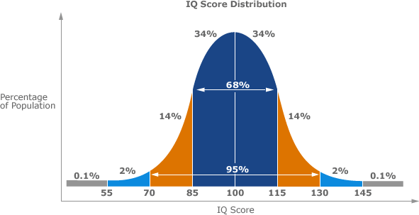

# rust-stochastics [](https://crates.io/crates/basic_stochastics) []() [](https://docs.rs/basic_stochastics/)
Small collection of basic stochastic calculations written in Rust

# Example
This library can help you to determine a [normal distribution](https://en.wikipedia.org/wiki/Normal_distribution), described by the values µ and σ
from a given data set.


Lets look at an example of a normal distribution for the average IQ score.



Here, we can see that the average value for the IQ is 100 ( µ = 100 ), because it is the local maximum of the graph.

Furthermore we see colored areas, which cover a specific percentage of the graphs area.
So we can see, that 68% of the population have an IQ score between 85 and 110, whereas 95% have an IQ score 
between 70 and 130.

In mathematics, we consider such an area, filling a specific percentage a sigma (σ) room.
(If you want to read more about σ, check out the [wikipedia article](https://en.wikipedia.org/wiki/Variance))

The 1σ environment is defined as the area covering about 68.27% of the graphs area.
In the given context this means that about 68.27% percent of the population have an IQ score between
µ - σ and µ + σ. Looking at the graph, we can determine sigma's value as 15 ( σ = 15 ).

The 2σ environment is covering an area of about 95.45%.
Please check [here](https://en.wikipedia.org/wiki/68%E2%80%9395%E2%80%9399.7_rule) for further reading

## Code example

rust_stochastics provides functions to calculate the average value (µ) and the scattering around the average value (σ)
from any given data set of ```Vec<f64>```

```
let data: Vec<f64> = vec![1.0, 2.0, 3.0, 4.0, 2.0];

let average = rust_stochastics::average(&data);
let sigma = basic_stochastics::empiric_deviation(&data);
```

Furthermore we can also check, if any given value matches a specific sigma room. If we look at our IQ score example again,
we can check, if an IQ of 70 matches the 1σ environment environment.

By looking at the graph, we can see it doesn't (the IQ score of 70 is the lower border value for the 2σ environment).

```
let sigma = 15.0;
let average = 100.0;

let result = rust_stochastics::matches_custom_sigma_environment(average, sigma, rust_stochastics::ONE_SIGMA, 70.0); // will be false
```

Finally we can also calculate µ and σ from a given data set and check, whether a value matches a specific sigma environment, then.

```
let data = vec![1.0, 2.0, 3.0, 4.0, 2.0];

let result = rust_stochastics::matches_sigma_environment(&data, rust_stochastics::ONE_SIGMA, 3.4); // will be true
```

**Important note** 

The given example does not match the [Laplace condition](https://en.wikipedia.org/wiki/De_Moivre%E2%80%93Laplace_theorem)
so that the given data set cannot be applied cleanly to a normal distribution.

When you want to modulate a custom normal distribution from your data, please ensure that

a) You have enough data

b) σ² > 9 resp. σ > 3

# Contributing
Feel free to leave a PR of create an issue, if you have any suggestions/bugs to report :)
